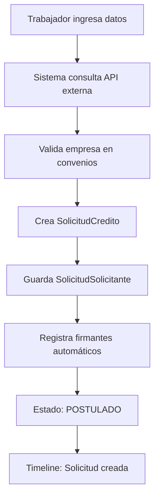
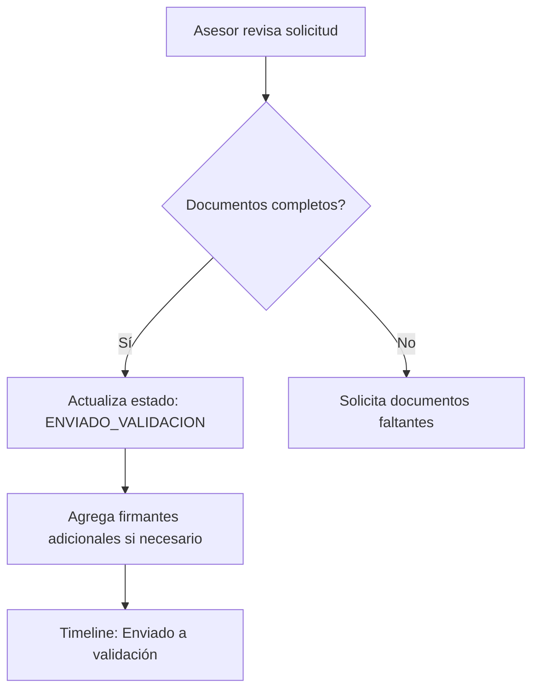
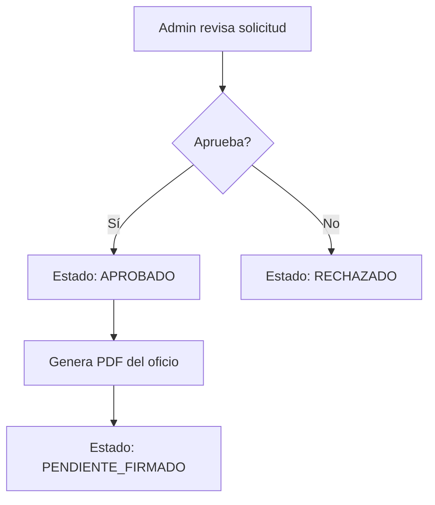
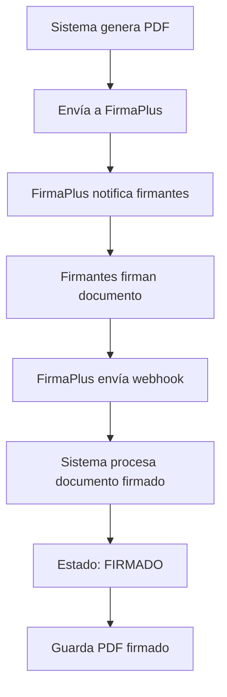
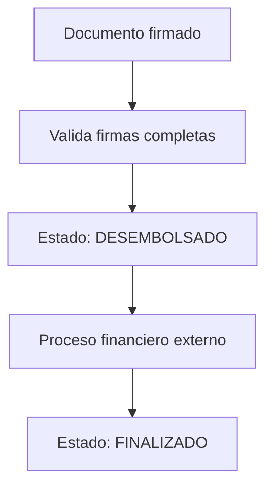

# Sistema de Gestión de Créditos - Backend API

Sistema backend desarrollado en Laravel para la gestión integral de solicitudes de crédito, con integración a servicios externos de firma digital y generación de documentos.

## 📋 Tabla de Contenidos

- [Descripción General](#descripción-general)
- [Requisitos del Sistema](#requisitos-del-sistema)
- [Instalación](#instalación)
- [Arquitectura](#arquitectura)
- [Modelos de Datos](#modelos-de-datos)
- [Servicios](#servicios)
- [Endpoints API](#endpoints-api)
- [Autenticación y Roles](#autenticación-y-roles)
- [Integraciones Externas](#integraciones-externas)
- [Flujo de Proceso](#flujo-de-proceso)
- [Funcionalidades Deprecadas](#funcionalidades-deprecadas)
- [Pendientes](#pendientes)
- [Mejoras y Recomendaciones](#mejoras-y-recomendaciones)

---

## Descripción General

Sistema de gestión de solicitudes de crédito que permite a trabajadores postular a créditos, a asesores gestionar las solicitudes, y a administradores aprobar y procesar las mismas. Incluye integración con firma digital mediante FirmaPlus y generación automatizada de documentos PDF.

### Características Principales

- ✅ Gestión completa del ciclo de vida de solicitudes de crédito
- ✅ Múltiples roles de usuario (Trabajador, Asesor, Administrador)
- ✅ Integración con API externa para datos empresariales y laborales
- ✅ Generación automática de documentos PDF (Oficios)
- ✅ Firma digital mediante proveedor FirmaPlus
- ✅ Sistema de firmantes configurable
- ✅ Timeline de seguimiento de estados
- ✅ Webhook para recepción de documentos firmados

---

## Requisitos del Sistema

- PHP 8.1+
- Laravel 10.x
- MySQL 8.0+
- Composer 2.x
- Extensiones PHP requeridas: PDO, OpenSSL, Mbstring, JSON

---

## Instalación

```bash
# Clonar el repositorio
git clone <repository-url>
cd credito-laravel-ssr

# Instalar dependencias
composer install

# Configurar variables de entorno
cp .env.example .env
php artisan key:generate

# Ejecutar migraciones
php artisan migrate

# Iniciar servidor de desarrollo
php artisan serve --port 8000
```

### Configuración de Variables de Entorno

```env
# Base de datos
DB_CONNECTION=mysql
DB_HOST=127.0.0.1
DB_PORT=3306
DB_DATABASE=credito_db
DB_USERNAME=root
DB_PASSWORD=

# API Externa - Datos Empresariales
EXTERNAL_API_URL=https://api.external.com
EXTERNAL_API_TOKEN=your_token_here

# API de Generación de PDF
PDF_API_URL=https://pdf.api.com
PDF_API_KEY=your_pdf_key

# FirmaPlus - Firma Digital
FIRMAPLUS_API_URL=https://api.firmaplus.com
FIRMAPLUS_TOKEN=your_firmaplus_token
FIRMAPLUS_WEBHOOK_SECRET=your_webhook_secret
```

---

## Arquitectura

```
credito-laravel-ssr/
├── app/
│   ├── Http/
│   │   ├── Controllers/
│   │   │   ├── Api/
│   │   │   │   ├── SolicitudesCreditoController.php
│   │   │   │   ├── SolicitudPdfController.php
│   │   │   │   ├── FirmantesController.php
│   │   │   │   └── FirmaPlusWebhookController.php
│   │   ├── Resources/
│   │   │   ├── ApiResource.php
│   │   │   └── ErrorResource.php
│   │   └── Middleware/
│   │       ├── AuthenticateApi.php
│   │       └── CheckRole.php
│   ├── Models/
│   │   ├── SolicitudCredito.php
│   │   ├── SolicitudPayload.php
│   │   ├── SolicitudSolicitante.php
│   │   ├── SolicitudTimeline.php
│   │   ├── FirmanteSolicitud.php
│   │   ├── EmpresaConvenio.php
│   │   ├── EstadoSolicitud.php
│   │   └── User.php
│   ├── Services/
│   │   ├── SolicitudService.php
│   │   ├── TrabajadorService.php
│   │   ├── ExternalApiService.php
│   │   ├── PdfGeneratorService.php
│   │   └── FirmaPlusService.php
│   └── Exceptions/
│       └── ValidationException.php
├── routes/
│   ├── api.php
│   └── api/
│       ├── solicitudes-credito.php
│       ├── firmantes.php
│       └── webhooks.php
└── database/
    └── migrations/
```

---

## Modelos de Datos

### `SolicitudCredito`
Modelo principal que representa una solicitud de crédito.

**Campos principales:**
- `numero_solicitud` (PK): Identificador único
- `owner_username`: Usuario propietario
- `estado`: Estado actual (POSTULADO, ENVIADO_VALIDACION, APROBADO, etc.)
- `monto_solicitado`: Monto del crédito
- `plazo_meses`: Plazo en meses
- `timeline`: JSON con historial de estados

**Relaciones:**
- `solicitante`: `hasOne` → `SolicitudSolicitante`
- `payload`: `hasOne` → `SolicitudPayload`
- `firmantes`: `hasMany` → `FirmanteSolicitud`
- `timelines`: `hasMany` → `SolicitudTimeline`

### `FirmanteSolicitud`
Gestiona los firmantes requeridos para el proceso de firma.

**Campos:**
- `solicitud_id`: Referencia a solicitud
- `orden`: Orden de firma (1, 2, 3...)
- `tipo`: POSTULANTE, EMPRESA_CONVENIO, CODEUDOR, etc.
- `rol`: SOLICITANTE_PRINCIPAL, EMPRESA_PATROCINADORA, etc.
- `nombre_completo`: Nombre del firmante
- `numero_documento`: Documento de identidad
- `email`: Email para notificaciones

**Roles disponibles:**
- SOLICITANTE_PRINCIPAL
- EMPRESA_PATROCINADORA
- CODEUDOR
- FIADOR
- REPRESENTANTE_LEGAL
- TESTIGO

### `SolicitudSolicitante`
Datos personales y laborales del solicitante.

**Campos principales:**
- `tipo_persona`: natural/jurídica
- `tipo_documento`: CC, CE, NIT
- `numero_documento`: Identificación
- `nombres`, `apellidos`, `email`, `telefono`
- `nit`: NIT de empresa empleadora
- `razon_social`: Razón social de empresa
- `cargo`, `salario`, `antiguedad_meses`

### `EmpresaConvenio`
Empresas con convenio para créditos.

**Campos:**
- `nit`: NIT de la empresa
- `razon_social`: Nombre de la empresa
- `estado`: Activo/Inactivo
- `representante_nombre`, `representante_documento`
- `correo`, `telefono`, `direccion`

### `SolicitudTimeline`
Historial de cambios de estado y eventos.

**Campos:**
- `solicitud_id`: Referencia
- `estado`: Estado registrado
- `fecha`: Timestamp del evento
- `detalle`: Descripción del cambio
- `usuario_username`: Usuario que realizó el cambio
- `automatico`: Si fue automático o manual

---

## Servicios

### `SolicitudService`
Lógica de negocio para solicitudes de crédito.

**Métodos principales:**
- `crearSolicitud(array $data, string $username)`: Crea nueva solicitud
- `actualizarEstado(string $numeroSolicitud, string $estado)`: Cambia estado
- `contarSolicitudesPorEstado(?string $username)`: Estadísticas
- `listarSolicitudesCreditoPaginado()`: Listado paginado
- `guardarFirmante()`: Registra firmantes automáticamente

### `TrabajadorService`
Gestión de trabajadores y datos laborales.

**Métodos:**
- `buscarTrabajador(array $criteria)`: Búsqueda de trabajadores
- `obtenerDatosLaborales(string $documento)`: Info laboral

### `ExternalApiService`
Integración con API externa para datos empresariales.

**Endpoints:**
- `/empresas/convenios`: Lista empresas con convenio
- `/trabajadores/{documento}`: Datos del trabajador
- `/conyuges/{documento}`: Información del cónyuge
- `/parametros/credito`: Parámetros para cálculo

### `PdfGeneratorService`
Generación de documentos PDF (Oficios).

**Métodos:**
- `generarOficio(string $numeroSolicitud)`: Genera PDF del oficio
- `obtenerPlantilla(string $tipo)`: Obtiene plantilla de documento

### `FirmaPlusService`
Integración con proveedor de firma digital.

**Métodos:**
- `enviarDocumentoParaFirma(array $datos)`: Envía documento a FirmaPlus
- `verificarEstadoFirma(string $documentId)`: Consulta estado
- `procesarDocumentoFirmado(array $payload)`: Procesa webhook

---

## Endpoints API

### Autenticación

```http
POST /api/auth/login
POST /api/auth/logout
POST /api/auth/refresh
```

### Solicitudes de Crédito

```http
# Crear solicitud
POST /api/solicitudes-credito
Content-Type: application/json
Authorization: Bearer {token}

{
  "solicitante": {
    "tipo_identificacion": "CC",
    "numero_identificacion": "1234567890",
    "nombres_apellidos": "Juan Pérez",
    "email": "juan@email.com",
    "telefono_movil": "3001234567",
    "empresa_nit": "900123456",
    "empresa_razon_social": "Empresa XYZ"
  },
  "solicitud": {
    "valor_solicitado": 5000000,
    "plazo_meses": 24,
    "destino_credito": "Educación"
  }
}

# Listar solicitudes (paginado)
GET /api/solicitudes-credito?limit=10&offset=0&estado=POSTULADO

# Obtener solicitud por número
GET /api/solicitudes-credito/{numero_solicitud}

# Actualizar estado
PUT /api/solicitudes-credito/{numero_solicitud}/estado
{
  "estado": "APROBADO",
  "comentario": "Solicitud aprobada por comité"
}

# Contar solicitudes por estado
GET /api/solicitudes-credito/estadisticas/por-estado

# Respuesta:
{
  "data": {
    "POSTULADO": 5,
    "ENVIADO_VALIDACION": 3,
    "APROBADO": 2,
    "RECHAZADO": 1
  },
  "message": "Conteo de solicitudes obtenido exitosamente",
  "success": true
}
```

### Firmantes

```http
# Listar firmantes de una solicitud
GET /api/solicitudes-credito/{numero_solicitud}/firmantes

# Agregar firmante
POST /api/solicitudes-credito/{numero_solicitud}/firmantes
{
  "orden": 3,
  "tipo": "CODEUDOR",
  "rol": "CODEUDOR",
  "nombre_completo": "María López",
  "numero_documento": "9876543210",
  "email": "maria@email.com"
}

# Eliminar firmante
DELETE /api/solicitudes-credito/{numero_solicitud}/firmantes/{orden}

# Obtener roles disponibles
GET /api/firmantes/roles
```

### Generación de PDF

```http
# Generar oficio PDF
POST /api/solicitudes-credito/{numero_solicitud}/generar-pdf

# Descargar PDF generado
GET /api/solicitudes-credito/{numero_solicitud}/pdf/download
```

### Firma Digital (FirmaPlus)

```http
# Enviar documento para firma
POST /api/solicitudes-credito/{numero_solicitud}/enviar-firma
{
  "firmantes": [
    {
      "orden": 1,
      "email": "firmante1@email.com"
    },
    {
      "orden": 2,
      "email": "firmante2@email.com"
    }
  ]
}

# Webhook de FirmaPlus (recepción de documento firmado)
POST /api/webhooks/firmaplus
X-Webhook-Secret: {webhook_secret}
{
  "document_id": "FP-123456",
  "status": "FIRMADO",
  "solicitud_id": "SOL-2024-001",
  "signed_document_url": "https://firmaplus.com/documents/signed/123456",
  "firmantes_completados": [
    {
      "orden": 1,
      "nombre": "Juan Pérez",
      "fecha_firma": "2024-02-04T20:30:00Z"
    }
  ]
}
```

---

## Autenticación y Roles

### Roles de Usuario

#### **1. user_trabajador**
Usuario trabajador que postula a créditos.

**Permisos:**
- ✅ Crear solicitud de crédito
- ✅ Ver sus propias solicitudes
- ✅ Actualizar información personal
- ❌ No puede aprobar solicitudes
- ❌ No puede gestionar firmantes

#### **2. user_adviser (Asesor)**
Usuario asesor que gestiona solicitudes.

**Permisos:**
- ✅ Ver todas las solicitudes
- ✅ Actualizar estado de solicitudes
- ✅ Agregar/eliminar firmantes
- ✅ Generar documentos PDF
- ✅ Enviar a firma digital
- ❌ Aprobar definitivamente (solo recomendar)

#### **3. administrator**
Administrador con acceso completo.

**Permisos:**
- ✅ Acceso completo a todas las solicitudes
- ✅ Aprobar/rechazar solicitudes
- ✅ Gestionar firmantes
- ✅ Configurar parámetros del sistema
- ✅ Acceder a estadísticas completas
- ✅ Gestionar empresas convenio

#### **4. firmaplus_service**
Usuario especial para el servicio FirmaPlus.

**Permisos:**
- ✅ Solicitar token de autenticación
- ✅ Enviar documentos firmados vía webhook
- ✅ Consultar estado de documentos
- ❌ Sin acceso a otros endpoints

### Autenticación

El sistema usa autenticación basada en tokens Bearer JWT.

```http
Authorization: Bearer {token}
```

---

## Integraciones Externas

### 1. API Externa - Datos Empresariales

**Base URL:** Configurado en `EXTERNAL_API_URL`

**Endpoints utilizados:**
- `GET /empresas/convenios` - Lista empresas con convenio
- `GET /trabajadores/{documento}` - Datos del trabajador
- `GET /trabajadores/{documento}/conyugue` - Info del cónyuge
- `GET /trabajadores/{documento}/laboral` - Información laboral
- `GET /parametros/credito` - Parámetros para cálculo de crédito

**Autenticación:** Token Bearer en header `Authorization`

### 2. API de Generación de PDF

**Base URL:** Configurado en `PDF_API_URL`

**Endpoints:**
- `POST /generate` - Genera PDF desde plantilla
- `GET /templates` - Lista plantillas disponibles

**Parámetros requeridos:**
- `template_id`: ID de plantilla
- `data`: Datos para rellenar plantilla
- `output_format`: PDF

### 3. FirmaPlus - Firma Digital

**Base URL:** Configurado en `FIRMAPLUS_API_URL`

#### **Endpoints para envío:**

```http
POST /api/v1/documents/sign
Authorization: Bearer {FIRMAPLUS_TOKEN}
Content-Type: application/json

{
  "document": {
    "file_url": "https://your-domain.com/documents/SOL-2024-001.pdf",
    "filename": "Oficio_SOL-2024-001.pdf",
    "reference": "SOL-2024-001"
  },
  "signers": [
    {
      "order": 1,
      "name": "Juan Pérez",
      "email": "juan@email.com",
      "id_number": "1234567890",
      "role": "SOLICITANTE"
    },
    {
      "order": 2,
      "name": "Empresa XYZ",
      "email": "empresa@xyz.com",
      "id_number": "900123456",
      "role": "EMPRESA"
    }
  ],
  "webhook_url": "https://your-domain.com/api/webhooks/firmaplus",
  "callback_method": "POST"
}
```

#### **Webhook de respuesta:**

FirmaPlus notificará al endpoint configurado cuando:
- El documento esté completamente firmado
- Algún firmante rechace el documento
- El proceso expire

**Endpoint interno:** `/api/webhooks/firmaplus`

**Validación:** Header `X-Webhook-Secret` debe coincidir con `FIRMAPLUS_WEBHOOK_SECRET`

**Payload esperado:**
```json
{
  "event": "document.signed",
  "document_id": "FP-123456",
  "reference": "SOL-2024-001",
  "status": "COMPLETED",
  "signed_document_url": "https://firmaplus.com/signed/FP-123456.pdf",
  "signed_at": "2024-02-04T20:30:00Z",
  "signers": [
    {
      "order": 1,
      "name": "Juan Pérez",
      "signed": true,
      "signed_at": "2024-02-04T19:15:00Z"
    },
    {
      "order": 2,
      "name": "Empresa XYZ",
      "signed": true,
      "signed_at": "2024-02-04T20:30:00Z"
    }
  ]
}
```

---

## Flujo de Proceso

### 1. Postulación (Usuario Trabajador)



**Firmantes automáticos:**
1. **Orden 1:** Solicitante principal (trabajador)
2. **Orden 2:** Empresa patrocinadora (si tiene NIT y convenio activo)

### 2. Validación (Asesor)



### 3. Aprobación (Administrador)



### 4. Firma Digital



### 5. Desembolso



---

## Funcionalidades Deprecadas

### ⚠️ Generación y Firma de XML

**Estado:** DEPRECADO - No usar en nuevas implementaciones

**Métodos obsoletos:**
- `generarXmlSolicitud()` - Generaba XML para firma
- `firmarXmlDocumento()` - Firmaba XML con certificado digital
- `validarFirmaXml()` - Validaba firma XML

**Razón de deprecación:**
El proceso de firma XML fue reemplazado por firma digital PDF mediante FirmaPlus, que ofrece:
- ✅ Mayor compatibilidad
- ✅ Mejor experiencia de usuario
- ✅ Validez legal equivalente
- ✅ Integración más simple
- ✅ Trazabilidad mejorada

**Migración:**
Si encuentras código que usa XML, reemplázalo por:
```php
// Antiguo (DEPRECADO)
$xml = $service->generarXmlSolicitud($numeroSolicitud);
$firmado = $service->firmarXmlDocumento($xml);

// Nuevo (RECOMENDADO)
$pdf = $pdfService->generarOficio($numeroSolicitud);
$resultado = $firmaPlusService->enviarDocumentoParaFirma([
    'solicitud_id' => $numeroSolicitud,
    'pdf_url' => $pdf['url'],
    'firmantes' => $firmantes
]);
```

---

## Pendientes

### Alta Prioridad

- [ ] **Implementar manejo completo de webhook FirmaPlus**
  - Validación de firma del webhook
  - Descarga automática de PDF firmado
  - Almacenamiento seguro de documentos firmados
  - Notificaciones a usuarios cuando documento esté listo

- [ ] **Sistema de notificaciones**
  - Email a solicitante cuando cambia estado
  - Email a firmantes cuando deben firmar
  - Notificaciones push para asesores/admins
  - Panel de notificaciones en frontend

- [ ] **Validaciones de negocio**
  - Validar monto máximo según salario
  - Validar plazo según antigüedad
  - Validar capacidad de endeudamiento
  - Reglas de negocio configurables

### Media Prioridad

- [ ] **Dashboard de estadísticas**
  - Métricas de solicitudes por periodo
  - Tiempos promedio de procesamiento
  - Tasas de aprobación/rechazo
  - Reportes exportables

- [ ] **Sistema de documentos adjuntos**
  - Subida de documentos de soporte
  - Validación de documentos requeridos
  - Versionamiento de documentos
  - Almacenamiento seguro (S3/local)

- [ ] **Auditoría completa**
  - Log de todas las acciones de usuarios
  - Registro de cambios en solicitudes
  - Trazabilidad de documentos
  - Reportes de auditoría

### Baja Prioridad

- [ ] **Tests automatizados**
  - Unit tests para servicios
  - Integration tests para APIs
  - Tests de webhook FirmaPlus
  - Tests de roles y permisos

- [ ] **Documentación API con Swagger/OpenAPI**
  - Especificación completa de endpoints
  - Ejemplos de requests/responses
  - Playground interactivo

- [ ] **Rate limiting y throttling**
  - Límites por usuario/IP
  - Protección contra ataques DDoS
  - Colas para procesos pesados

---

## Mejoras y Recomendaciones

### 🔒 Seguridad

1. **Encriptación de datos sensibles**
   - Implementar encriptación en base de datos para:
     - Números de documento
     - Datos bancarios (si aplica)
     - Información financiera sensible
   - Usar Laravel encryption para campos críticos

2. **Validación de webhook FirmaPlus**
   ```php
   // Implementar firma HMAC para validar webhook
   $signature = hash_hmac('sha256', $payload, config('firmaplus.webhook_secret'));
   if (!hash_equals($signature, $request->header('X-Signature'))) {
       abort(401, 'Invalid signature');
   }
   ```

3. **Logs de seguridad**
   - Registrar intentos de acceso fallidos
   - Alertas para actividades sospechosas
   - Rotación de tokens periódica

### ⚡ Performance

1. **Cacheo de datos frecuentes**
   ```php
   // Cachear empresas convenio activas
   $empresas = Cache::remember('empresas_convenio_activas', 3600, function() {
       return EmpresaConvenio::where('estado', 'Activo')->get();
   });
   ```

2. **Optimización de queries**
   - Usar eager loading para relaciones
   - Índices en campos de búsqueda frecuente
   - Paginación en listados grandes

3. **Jobs asíncronos**
   - Generación de PDF en background
   - Envío de emails en cola
   - Procesamiento de webhooks asíncrono

### 🏗️ Arquitectura

1. **Separación de responsabilidades**
   - Mover lógica de negocio compleja a Services
   - Controllers delgados, solo orquestación
   - Usar Form Requests para validaciones

2. **Repository Pattern**
   ```php
   // Abstraer acceso a datos
   interface SolicitudRepositoryInterface {
       public function findByNumero(string $numero);
       public function crearConFirmantes(array $data);
   }
   ```

3. **Event Sourcing para timeline**
   - Usar Laravel Events para cambios de estado
   - Listeners automáticos para timeline
   - Mejor trazabilidad y desacoplamiento

### 📊 Monitoreo

1. **Logging estructurado**
   - Usar contexto en logs
   - Niveles apropiados (info, warning, error)
   - Integración con Sentry/Bugsnag

2. **Métricas de negocio**
   - Tiempo promedio de aprobación
   - Tasa de conversión de solicitudes
   - Tiempo de firma por firmante

3. **Health checks**
   ```php
   // Endpoint de salud del sistema
   GET /api/health
   {
       "status": "ok",
       "database": "connected",
       "external_api": "available",
       "firmaplus": "available"
   }
   ```

### 🧪 Testing

1. **Tests de integración con APIs externas**
   - Usar mocks para desarrollo
   - Tests contra sandbox de FirmaPlus
   - Fixtures para respuestas de APIs

2. **Tests de roles y permisos**
   ```php
   public function test_trabajador_no_puede_aprobar_solicitud()
   {
       $this->actingAs($trabajador)
           ->put("/api/solicitudes/{$solicitud}/estado", ['estado' => 'APROBADO'])
           ->assertForbidden();
   }
   ```

### 📝 Documentación

1. **API Documentation**
   - Implementar Swagger/OpenAPI
   - Mantener ejemplos actualizados
   - Documentar códigos de error

2. **Diagramas de flujo**
   - Documentar flujos complejos con Mermaid
   - Diagrama de estados de solicitud
   - Secuencia de integración FirmaPlus

3. **Guías de integración**
   - Setup de ambientes
   - Configuración de webhooks
   - Troubleshooting común

---

## Soporte y Contacto

Para reportar bugs o solicitar features, crear un issue en el repositorio o contactar al equipo de desarrollo.

## Licencia

[Especificar licencia del proyecto]

---

**Última actualización:** Febrero 2024  
**Versión:** 1.0.0
